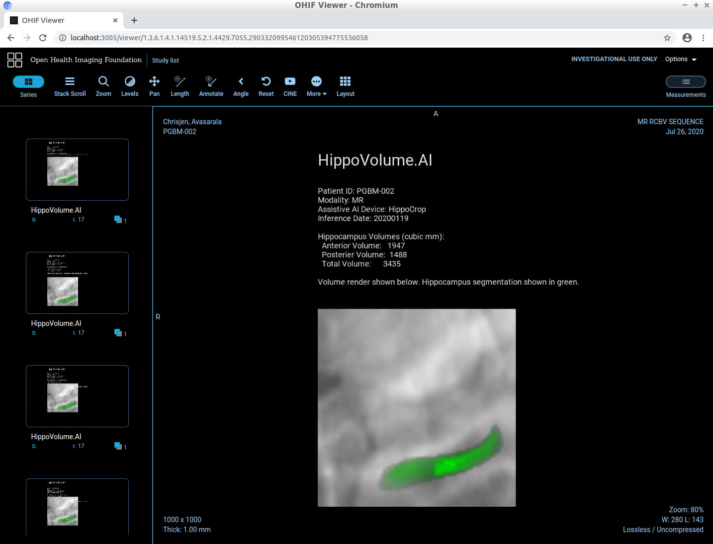

# Section 3: Integrating into a Clinical Network

Artifacts from Section 3: 
  
* Code that runs inference on a DICOM volume and produces a DICOM report
* A report.dcm file with a sample report
* Screenshots of report shown in the OHIF viewer
* Validation Plan PDF

Hippocampal Volume Report:

Section 3: Integrating into a Clinical Network

Udacity Instructions:

In Section 3, we create an AI product that can be integrated into a clinical network and provide the auto-computed information on the hippocampal volume to the clinicians.

Install and configure:

- [Orthanc server](https://www.orthanc-server.com/download.php) for PACS emulation
- [OHIF zero-footprint web viewer](https://docs.ohif.org/development/getting-started.html) for viewing images. Note that if you deploy OHIF from its github repository, at the moment of writing the repo includes a yarn script (orthanc:up) where it downloads and runs the Orthanc server from a Docker container. If that works for you, you won't need to install Orthanc separately.
- If you are using Orthanc (or other DICOMWeb server), you will need to configure OHIF to read data from your server. OHIF has instructions for this: https://docs.ohif.org/configuring/data-source.html
- In order to fully emulate the Udacity workspace, you will also need to configure Orthanc for auto-routing of studies to automatically direct them to your AI algorithm. For this you will need to take the script that you can find at section3/src/deploy_scripts/route_dicoms.lua and install it to Orthanc as explained on this page: https://book.orthanc-server.com/users/lua.html
- [DCMTK tools](https://dcmtk.org/) for testing and emulating a modality. Note that if you are running a Linux distribution, you might be able to install dcmtk directly from the package manager (e.g. apt-get install dcmtk in Ubuntu)

This section replicates the following clinical network setup:

Specifically, we have the following software in this setup:

- MRI scanner is represented by a script section3/src/deploy_scripts/send_volume.sh. When you run this script it will simulate what happens after a radiological exam is complete, and send a volume to the clinical PACS. Note that scanners typically send entire studies to archives. PACS server is represented by Orthanc deployment that is listening to DICOM DIMSE requests on port 4242. Orthanc also has a DicomWeb interface that is exposed at port 8042, prefix /dicom-web. There is no authentication and you are welcome to explore either one of the mechanisms of access using a tool like curl or Postman. PACS server is also running an auto-routing module that sends a copy of everything it receives to an AI server.
- Viewer system is represented by OHIF. It is connecting to the Orthanc server using DicomWeb and is serving a web application on port 3000. Again, see instructions at the end of this page if you are using the Udacity Workspace.
- AI server is represented by a couple of scripts. section3/src/deploy_scripts/start_listener.sh brings up a DCMTK's storescp and configures it to just copy everything it receives into a directory that you will need to specify by editing this script, organizing studies as one folder per study. HippoVolume.AI is the AI module that you will create in this section.

inference_dcm.py contains code that will analyze the directory of the AI server that contains the routed studies, find the right series to run the algorithm on, generate DICOM report, and push it back to PACS.

Note that in real system you would architect things a bit differently. Probably, AI server would be a separate piece of software that would monitor the output of the listener, and would manage multiple AI modules, deciding which one to run, automatically. In our case, for the sake of simplicity, all code sits in one Python script that you would have to run manually after you simulate an exam via the send_volume.sh script - inference_dcm.py. It combines the functions of processing of the listener output and executing the model, and it does not do any proper error handling.

Execute the code by running:
deploy_scripts/send_volume.sh

which will simulate a completion of MRI study and sending of patient data to our PACS, and then following that by running inference_dcm.py

The send_volume.sh script needs to be run from directory section3/src (because it relies on relative paths). An MRI scan will be sent to the PACS and to your module which will compute the volume, prepare the report and push it back to the PACS so that it could be inspected in the clinical viewer.

At this point, go to [YOUR IP ADDRESS]:3000 which brings up our OHIF viewer. You should be able to inspect your report in all its glory, in the context of a radiological study presented to a radiologist in a clinical viewer!

The study that send_result.sh sends, and a few other sample studies are located in /data/TestVolumes. Feel free to modify the script to try out your algorithm with other volumes.

Access Orthanc and OHIF
Steps to launch Orthanc and OHIF:

1. Open a terminal and enter the following:
bash launch_orthanc.sh or ./launch_orthanc.sh. Don't close this terminal
2. Wait for it to complete, with the last line being something like
W0509 05:38:21.152402 main.cpp:719] Orthanc has started and/or you can verify that Orthanc is working by running echoscu 127.0.0.1 4242 -v in a new terminal.
3. Open a new terminal and enter the following
bash launch_OHIF.sh or ./launch_OHIF.sh. Don't close this terminal
4. Wait for it to complete, with the last line being something like
@ohif/viewer: ℹ ｢wdm｣: Compiled with warnings.
5. You will then want to enter the Desktop and go to the browser.
- OHIF should automatically open in a Chromium Web Browser but if not you can paste localhost:3005 into the address bar of a Chromium Window.
- orthanc isn't necessary to open but if you need it you can access it can paste localhost:8042 into the address bar of a Chromium Window.
